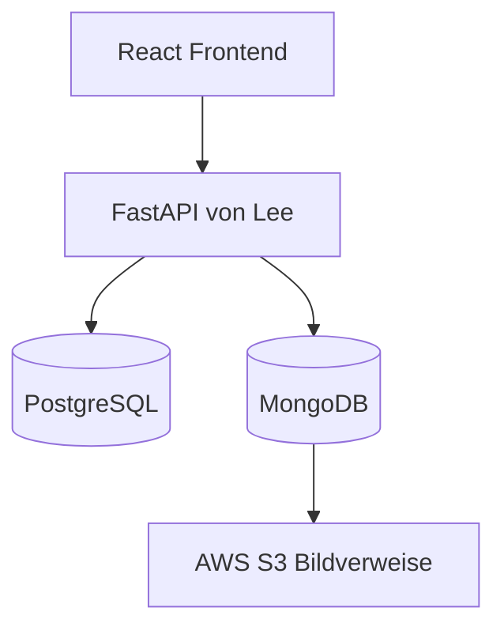

 🍪 Cookino Shop – mein Datenbankteil

Moin, ich bin Chris und in unserem Cookino-Shop-Projekt bin ich für die
Datenbanken zuständig.

Meine Aufgabe war es, den alten Datenbankstand so umzubauen, dass wir nicht
mehr alles in einer einzigen Datenbank speichern. Der Shop nutzt jetzt
**PostgreSQL und MongoDB gemeinsam**. Die Produktbilder bleiben weiterhin in
**AWS S3**.

Klingt erst einmal nach vielen Baustellen, ist aber sauber aufgeteilt:

- PostgreSQL kümmert sich um alles, was fest strukturiert und wichtig für den
  eigentlichen Shopbetrieb ist.
- MongoDB speichert flexible Inhalte wie Beschreibungen, Tags und Bilddaten.
- AWS S3 speichert die echten Bilddateien.
- FastAPI verbindet später alles miteinander und liefert die Daten an React.

## Was war mein Ziel?

Mein Ziel war eine Datenbankstruktur, die nicht nur irgendwie startet, sondern
auch wirklich zu unseren Python-Dateien und Lees FastAPI passt.

Am Ende sollten folgende Punkte funktionieren:

- PostgreSQL und MongoDB starten gemeinsam über Docker Compose.
- Die Daten bleiben durch Docker Volumes erhalten.
- Datenbankports werden nicht unnötig nach außen veröffentlicht.
- Produkte und Kollektionen besitzen in beiden Datenbanken dieselben UUIDs.
- Preise, Varianten und Lagerbestände kommen ausschließlich aus PostgreSQL.
- Beschreibungen und S3-Verweise kommen aus MongoDB.
- Bilder selbst werden nicht doppelt in der Datenbank gespeichert.
- `shop_main.py`, `konto_shop.py` und `warenkorb.py` passen zum neuen Schema.
- Der komplette Stand lässt sich mit einem Smoke-Test überprüfen.

## Die Architektur



React greift niemals direkt auf PostgreSQL oder MongoDB zu. Das Frontend
spricht nur mit FastAPI. FastAPI ruft anschließend die passenden Funktionen
aus meinen drei Python-Dateien auf.

## Warum benutzen wir zwei Datenbanken?

Das Ganze nennt sich **Polyglot Persistence**. Dabei wird nicht zwanghaft alles
in dieselbe Datenbank gepackt, sondern jede Datenbank übernimmt die Aufgabe,
für die sie gut geeignet ist.

| PostgreSQL | MongoDB | AWS S3 |
|---|---|---|
| Nutzer und Rollen | Produktbeschreibungen | Echte Bilddateien |
| Kollektionen und Produkte | Tags und Materialangaben | Produktbilder |
| Größen und Varianten | Pflegehinweise | Banner und Grafiken |
| Preise und Lagerbestand | Flexible Zusatzinformationen | |
| Warenkörbe | S3-Keys und Alt-Texte | |
| Bestellungen | Bildreihenfolge | |

Wichtig: Preis und Lagerbestand werden nicht in MongoDB dupliziert. Dafür ist
PostgreSQL die führende Datenbank.

## Ordnerstruktur

```text
cookino_backend_aktuell/
├── mongodb/
│   ├── init-mongo.js
│   └── seed-products.js
├── postgres/
│   ├── init.sql
│   ├── schema.sql
│   └── seed.sql
├── .env.example
├── compose.yaml
├── db_smoketest.py
├── konto_shop.py
├── requirements.txt
├── shop_main.py
├── warenkorb.py
└── README.md
```

## PostgreSQL

PostgreSQL ist die Hauptdatenbank für alle strukturierten Shopdaten.

Folgende Tabellen werden erstellt:

| Tabelle | Aufgabe |
|---|---|
| `rollen` | Rollen wie Admin, Leiter, Kunde und Gast |
| `nutzer` | Konten, E-Mail, Passwort-Hash und Rolle |
| `kollektionen` | Die drei Cookino-Kollektionen |
| `produkte` | Produktname, Preis und Zuordnung zur Kollektion |
| `groessen` | Größen von XS bis XXL und Einheitsgröße |
| `produkt_varianten` | Größe, Farbe, Artikelnummer und Lagerbestand |
| `warenkoerbe` | Aktiver Warenkorb eines Nutzers |
| `warenkorb_artikel` | Varianten und Mengen im Warenkorb |
| `bestellungen` | Bestellung, Status und Gesamtpreis |
| `bestellung_artikel` | Momentaufnahme der einzelnen Bestellpositionen |

### Warum Produktvarianten?

Ein Hoodie ist nicht einfach nur ein Produkt. Er kann zum Beispiel in Größe S,
M oder XL bestellt werden. Jede Größe besitzt deshalb eine eigene
`produkt_variante_id` und einen eigenen Lagerbestand.

So weiß der Shop ganz genau, welche Variante wirklich gekauft wurde. Das ist
deutlich sauberer, als Größe und Lagerbestand irgendwie am Produktnamen
festzukleben.

## MongoDB

MongoDB ergänzt die Produkte um Inhalte, die sich flexibel erweitern lassen.

Es gibt drei Collections:

| Collection | Aufgabe |
|---|---|
| `produkt_inhalte` | Beschreibung, Charakter, Tags, Material und Pflege |
| `kollektion_inhalte` | Beschreibung und Geschichte einer Kollektion |
| `medien` | S3-Key, Alt-Text, Besitzer und Bildposition |

MongoDB speichert keine Bilddateien. Ein Eintrag enthält zum Beispiel nur
einen S3-Key wie:

```text
produkte/cookino/cookino-hoodie.webp
```

Die Bilddatei selbst liegt weiterhin in AWS S3. Dadurch bleibt MongoDB klein
und wir speichern nichts doppelt.

## So werden PostgreSQL und MongoDB verbunden

Die Verbindung erfolgt über feste UUIDs.

```text
PostgreSQL: produkte.id
MongoDB:    produkt_inhalte.produkt_id
MongoDB:    medien.produkt_id
```

Wenn ein Produkt in PostgreSQL beispielsweise die UUID
`20000000-0000-4000-8000-000000000004` besitzt, verwendet MongoDB genau
dieselbe UUID für Beschreibung und Bildverweis.

Dadurch kann `shop_main.py` die Daten aus beiden Datenbanken eindeutig
zusammenführen.

## Aktuelle Testdaten

Der Seed-Stand enthält:

- 4 Rollen
- 7 Größen
- 3 Kollektionen
- 9 Produkte
- 21 Produktvarianten
- 9 MongoDB-Produktinhalte
- 3 MongoDB-Kollektionsinhalte
- 10 S3-Medienverweise

## Projekt starten

### 1. Umgebungsdatei anlegen

In PowerShell:

```powershell
Copy-Item .env.example .env
```

Die `.env` enthält die lokalen Zugangsdaten und darf nicht auf GitHub
hochgeladen werden.

### 2. Datenbanken starten

```powershell
docker compose up -d
```

### 3. Status prüfen

```powershell
docker compose ps
```

Bei PostgreSQL und MongoDB sollte jeweils `healthy` stehen.

## Kompletten Datenbankstand testen

Da die Namen `postgres` und `mongo` nur im Docker-Netzwerk erreichbar sind,
wird der Smoke-Test ebenfalls in diesem Netzwerk ausgeführt:

```powershell
docker run --rm --network cookino_backend --env-file .env -v "${PWD}:/app" -w /app python:3.13-slim sh -c "pip install -q -r requirements.txt && python db_smoketest.py"
```

Wenn alles passt, erscheint:

```text
OK: PostgreSQL und MongoDB sind erreichbar.
OK: PostgreSQL-Seeds stimmen.
OK: MongoDB-Seeds stimmen.
OK: Produkt- und Kollektion-UUIDs stimmen überein.
```

Diesen Test habe ich mit dem aktuellen Stand erfolgreich durchgeführt. Damit
ist geprüft, dass beide Datenbanken erreichbar sind und ihre gemeinsamen IDs
wirklich zusammenpassen.

## Die drei Python-Dateien

### `shop_main.py`

Diese Datei verbindet den Produktkatalog aus PostgreSQL mit den flexiblen
Inhalten aus MongoDB.

Wichtige Funktionen:

- `alle_kollektionen()`
- `alle_produkte()`
- `artikel_nach_kollektion()`
- `produkt_nach_id()`
- `shop_uebersicht()`
- `datenbanken_pruefen()`

### `konto_shop.py`

Diese Datei kümmert sich um Nutzerkonten, Login und Rollen.

Wichtige Funktionen:

- `registrieren()`
- `login()`
- `konto_aendern()`
- `konto_loeschen()`
- `rolle_aendern()`
- `hat_berechtigung()`

Passwörter werden nicht im Klartext gespeichert, sondern mit `scrypt` und
einem individuellen Salt gehasht.

### `warenkorb.py`

Diese Datei übernimmt Warenkorb, Lagerprüfung und Bestellungen.

Wichtige Funktionen:

- `artikel_hinzufuegen()`
- `warenkorb_anzeigen()`
- `menge_aendern()`
- `artikel_entfernen()`
- `warenkorb_leeren()`
- `bestellung_abschliessen()`
- `bestellungen_anzeigen()`
- `alle_bestellungen()`

Beim Checkout wird der Lagerbestand innerhalb einer PostgreSQL-Transaktion
geprüft und reduziert. So kann nicht einfach mehr bestellt werden, als wirklich
vorhanden ist.

## Übergabe an Lee und FastAPI

Lee muss in FastAPI keine eigenen Datenbankabfragen neu erfinden. Er kann die
Funktionen aus den drei Python-Dateien importieren und daraus seine Endpunkte
bauen.

Dabei sind folgende Punkte wichtig:

- PostgreSQL verwendet `%s` als SQL-Platzhalter und nicht das alte SQLite-`?`.
- Warenkorbfunktionen erwarten eine `produkt_variante_id` als UUID.
- Das Feld in `bestellungen` heißt `gesamtpreis`.
- FastAPI muss im Docker-Netzwerk `cookino_backend` laufen.
- Die internen Hosts heißen `postgres` und `mongo`.
- `alle_bestellungen()` ist für Admin oder Leiter gedacht.
- React spricht nur mit FastAPI und niemals direkt mit den Datenbanken.

## Wichtige Docker-Befehle

Container starten:

```powershell
docker compose up -d
```

Status anzeigen:

```powershell
docker compose ps
```

Logs anzeigen:

```powershell
docker compose logs
```

Container stoppen:

```powershell
docker compose down
```

Container und lokale Datenbank-Volumes löschen:

```powershell
docker compose down -v
```

⚠️ `docker compose down -v` löscht die gespeicherten lokalen Datenbankdaten.
Den Befehl benutze ich nur, wenn ich die Datenbanken wirklich komplett neu mit
den Seed-Dateien aufbauen möchte.

## Typische Fehler und meine Lösungen

### `No module named psycopg`

Die Python-Abhängigkeiten fehlen:

```powershell
python -m pip install -r requirements.txt
```

### `failed to resolve host 'postgres'`

Der Test wurde direkt unter Windows gestartet. Der Hostname `postgres`
existiert aber nur innerhalb des Docker-Netzwerks. Deshalb verwende ich den
oben beschriebenen `docker run`-Smoke-Test.

### Neue Seeds erscheinen nicht

Die Initialisierungsdateien werden nur ausgeführt, wenn das Volume zum ersten
Mal erstellt wird. Für einen komplett frischen lokalen Teststand:

```powershell
docker compose down -v
docker compose up -d
```

## Sicherheit

Folgende Punkte habe ich berücksichtigt:

- PostgreSQL und MongoDB veröffentlichen keine Ports nach außen.
- Zugangsdaten stehen in `.env` und nicht direkt im Code.
- `.env` gehört nicht ins GitHub-Repository.
- Passwörter werden als scrypt-Hash gespeichert.
- SQL-Werte werden parametrisiert übergeben.
- Fremdschlüssel und Constraints schützen die Datenstruktur.
- Lagerbestände dürfen nicht negativ werden.
- E-Mail-Adressen und Artikelnummern sind eindeutig.
- Bilddateien bleiben geschützt in AWS S3.
- Docker Volumes sorgen für persistente Daten.

## Mein Beitrag im Sprint

Für meinen Datenbankteil habe ich:

- PostgreSQL und MongoDB fachlich voneinander getrennt,
- das relationale PostgreSQL-Schema erstellt,
- MongoDB-Collections mit Validierung und Indizes angelegt,
- passende Seed-Daten für beide Datenbanken erstellt,
- feste UUID-Verknüpfungen zwischen beiden Systemen eingebaut,
- Produktvarianten mit Größen und Lagerbestand umgesetzt,
- S3-Bildverweise ohne doppelte Bildspeicherung integriert,
- Docker Compose mit Healthchecks und Volumes eingerichtet,
- die drei Python-Dateien auf den neuen Datenbankstand angepasst,
- `alle_bestellungen()` für Lees Adminbereich ergänzt,
- einen automatischen Smoke-Test geschrieben und erfolgreich ausgeführt,
- typische Fehler und die passenden Lösungen dokumentiert.

## Aktueller Stand

- [x] PostgreSQL startet und ist `healthy`
- [x] MongoDB startet und ist `healthy`
- [x] Persistente Volumes funktionieren
- [x] Seed-Daten werden geladen
- [x] PostgreSQL- und MongoDB-UUIDs stimmen überein
- [x] Python-Dateien passen zum Datenbankschema
- [x] S3-Verweise sind eingebaut
- [x] Smoke-Test läuft erfolgreich durch
- [x] Übergabe für FastAPI ist dokumentiert
- [ ] Gemeinsamer Test mit Lees aktueller FastAPI
- [ ] Gemeinsamer Test mit dem React-Frontend

## Mein Fazit

Am Anfang war es ehrlich gesagt ein ziemliches Durcheinander aus alten
SQLite-Abfragen, Supabase, neuen Docker-Containern und zwei unterschiedlichen
Datenbanken. Inzwischen ist klar geregelt, welche Daten wohin gehören und wie
alles miteinander verbunden wird.

Mein Datenbankteil ist damit nicht nur gestartet, sondern nachvollziehbar
aufgebaut, getestet und bereit für die Verbindung mit FastAPI und React.

Oder kurz gesagt: **Die Kekse liegen sauber im Regal. Jetzt muss der Shop sie
nur noch verkaufen. 🍪**